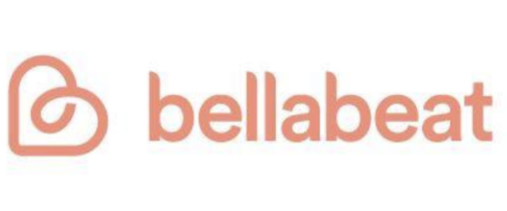

```{r setup, include=FALSE}
knitr::opts_chunk$set(echo = TRUE)
```

# Bellabeat Case Study
## Using R Studio



### <font color = 'F1C232'> Table Of Contents </font>
1. [Chapter 1: Introduction](#chapter1:introduction)
  * [1.1 Background](#background)
  * [1.2 Company Products](#CompanyProducts)
  
  
2. [Chapter 2: Ask Phase](#chapter2:askphase)
  * [2.1 Business Task](#businesstask)
  * [2.2 Questions For Analysis](#questions)
  * [2.3 List Of Stakeholders](#listofstakeholders)
  
  
3. [Chapter 3: Prepare](#chapter3:prepare)
  * [3.1 Data Used](#dataused)
  * [3.2 Data Summary](#datasummary)
  * [3.3 Data Organization](#dataorganization)
  * [3.4 Data Limitation](#datalimitation)

  
4. [Chapter 4: Process](#chapter4:process)
  * [4.1 Selected Datasets](#selecteddatasets)
  * [4.2 Using Excel To Preview Data](#usingexceltopreviewdata)
  
  
5. [Chapter 5: Analyzing The Data Sets](#analyzingthedatasets)
  * [5.1 Loading Packages](#loadingpackages)
  * [5.2 Importing Data Sets](#importingdatasets)
  * [5.3 Checking Data Sets](#checkingdatasets)
  * [5.4 Fixing Formating](#fixingformating)
  
  
6. [Chapter 6:Exploring & Summarizing Data](#summarizingdata)
  * [6.1 Merging Data](#mergingdata)
  * [6.2 Visualization](#visualization)
  
  
7. [Chapter 7: Conclusions & Recommedations](#conclusions)
  * [7.1 Who is the target audience?](#targetaudience)
  * [7.2 Main message for the online Bellabeat campaign](#mainmessage)
  * [7.3 Recommendations](#recommendations)
  
## <font color='2986CC'> Chapter 1: Introduction </font> <a class="anchor" id="chapter1:introduction" ></a>

### 1.1 Background <a class="anchor" id="background"></a>

##### Key Notes About The Company:

* A high-tech company that manufactures health-focused smart products for women all over the world.
* These products collect data on activity, sleep, stress, and reproductive health to give women the proper insight into their own health and habits.
* Founded in 2013.
* By 2016, expansion via opening multiple offices worldwide and multiple products (via online retailers and their own website).
* She wants the company to further blossom, by analyzing the consumer data from the smart devices. 

### 1.2 Company Products <a class="anchor" id="CompanyProducts"></a>

**Bellabeat's smart devices include**:

 1.**Bellabeat app**: The Bellabeat app provides users with health data related to their activity, sleep, stress, menstrual cycle, and mindfulness habits.
 
 2.**Leaf**: Bellabeat’s classic wellness tracker can be worn as a bracelet, necklace, or clip. 
 
 3.**Time**: This wellness watch combines the timeless look of a classic timepiece with smart technology to track user activity, sleep, and stress.
 
 4.**Spring**: This is a water bottle that tracks daily water intake using smart technology to ensure that you are appropriately hydrated throughout the day. 
 
The bellabeat app is compatible with all their products stated above, where patrons can monitor their wellness. Devices like time can track the number of steps taken, distance traversed, calories burned etc. menstrual cycle, sleep patterns along with hydration (using the “Spring” water bottle). The “Leaf” device can also track heart rate since it can be worn various ways where a pulse is present.

## <font color='2986CC'> Chapter 2: Ask Phase </font> <a class="anchor" id="chapter2:askphase" ></a>

### 2.1 Business Task <a class="anchor" id="businesstask"></a>

Gain insight into how users use their non-BellaBeat smart devices and help discover/enhance marketing strategies for the company to further growth. I will be concentrating on the Leaf product which tracks health activity.

### 2.2 Questions For Analysis <a class="anchor" id="questions"></a>

Business Questions:

1. What trends is present with usage of smart devices?

2. Can these trends be applicable to Bellabeat customers?

3. If so, how these trends can help enhance the company’s marketing strategy?


### 2.3 List Of Stakeholders <a class="anchor" id="listofstakeholders"></a>

1. **Urška Sršen**- Cofounder & Chief Creative Officer, has a background in artistry which aids her in creating informative and elegantly designed technology to improve the lives of women.

2. **Sando Mur**- Cofounder & Mathematician; an important figure of the Bellabeat executive team.

3. **Bellabeat Marketing Analytics Team**- A team of data analysts responsible for collecting, analyzing, and reporting data that helps guide Bellabeat’s marketing strategy.


## <font color='2986CC'> Chapter 3: Prepare </font> <a class="anchor" id="chapter3:prepare" ></a>

### 3.1 Data Used <a class="anchor" id="dataused"></a>
The [**Fitbit Fitness Tracker Data**](https://www.kaggle.com/datasets/arashnic/fitbit) dataset was used for this case study. Möbius uploaded the dataset on Kaggle where it was then downloaded.

### 3.2 Data Summary <a class="anchor" id="datasummary"></a>

This dataset was created by participants to a distributed survey curtesy Amazon Mechanical Turk between 3.12.2016 to 5.12.2016. Thirty suitable Fitbit users agreed their personal tracker data like heart rate, sleep monitoring, and minute-level output physical activity to be submitted for this case study.

### 3.3 Data Organization <a class="anchor" id="dataorganization"></a>

18 files were retrieved from the FitBit Fitness Tracker Data. The datasets are in .csv file format where there were wide and long formats. For analysis, the datasets I chose had a total of 33 volunteers over a period of 31 days.

### 3.4 Data Limitation <a class="anchor" id="datalimitation"></a>

1. The data collected **FitBit Fitness Tracker Data** was collected in 2016, making it outdated for the current trend analysis.

2. The data was collected through 3-12-2016 to 5-12-2016. Therefore, it is only a 31-day period.

3. Important demographic information like location, age, gender and job status are missing from the dataset. There is a possibility that sample bias can occur in the results.

## <font color='2986CC'> 3. Chapter 4: Process </font> <a class="anchor" id="chapter4:process" ></a>

### 4.1 Selected Datasets <a class="anchor" id="selecteddatasets"></a>

The selected datasets were chosen for this case study:

* hourly_steps_merged
* hourly_calories_merged
* daily_intensities_merged
* daily_activity_merged
* daily_sleep_merged
* minuteMETsNarrow_merged

### 4.2 Using Excel To Preview Data <a class="anchor" id="usingexceltopreviewdata"></a>

The datasets selected were cleaned using R. I previewed the datasets using Excel to familiarize myself with the data.

## <font color='2986CC'>Chapter 5: Analyzing The Data Sets </font> <a class="anchor" id="analyzingthedatasets" ></a>

### 5.1 Loading Packages <a class="anchor" id="loadingpackages"></a>


```{r loading packages}
library(tidyverse)
library(lubridate)
library(dplyr)
library(ggplot2)
library(tidyr)
```

### 5.2 Importing Data Sets <a class="anchor" id="importingdatasets"></a>

```{r loading data sets}
activity <- read.csv("~/Documents/Bellabeat/Bellabeat_Case_Study/FitBit_DataSet/dailyActivity_merged.csv")
calories <- read.csv("~/Documents/Bellabeat/Bellabeat_Case_Study/FitBit_DataSet/hourlyCalories_merged.csv")
intensities <- read.csv("~/Documents/Bellabeat/Bellabeat_Case_Study/FitBit_DataSet/hourlyIntensities_merged.csv")
sleep <- read.csv("~/Documents/Bellabeat/Bellabeat_Case_Study/FitBit_DataSet/sleepDay_merged.csv")
weight <- read.csv("~/Documents/Bellabeat/Bellabeat_Case_Study/FitBit_DataSet/weightLogInfo_merged.csv")
```

I already check .csv files in Excel, I'm going to use the head() and View() functions to assure all files were imported correctly.

### 5.3 Checking Data Sets <a class="anchor" id="checkingdatasets"></a>

```{r checking data sets}
head(activity)
head(calories)
head(intensities)
head(sleep)
head(weight)
```

In the activity data set, some errors appeared with the data time-stamp. So, Im going to change the format to date-time and split to data & time.

### 5.4 Fixing Formating <a class="anchor" id="fixingformating"></a>

```{r fixing the format}
# intensities
intensities$ActivityHour=as.POSIXct(intensities$ActivityHour, format="%m/%d/%Y %I:%M:%S %p", tz=Sys.timezone())
intensities$time <- format(intensities$ActivityHour, format = "%H:%M:%S")
intensities$date <- format(intensities$ActivityHour, format = "%m/%d/%y")

# calories
calories$ActivityHour=as.POSIXct(calories$ActivityHour, format="%m/%d/%Y %I:%M:%S %p", tz=Sys.timezone())
calories$time <- format(calories$ActivityHour, format = "%H:%M:%S")
calories$date <- format(calories$ActivityHour, format = "%m/%d/%y")

# activity
activity$ActivityDate=as.POSIXct(activity$ActivityDate, format="%m/%d/%Y", tz=Sys.timezone())
activity$date <- format(activity$ActivityDate, format = "%m/%d/%y")

# sleep
sleep$SleepDay=as.POSIXct(sleep$SleepDay, format="%m/%d/%Y %I:%M:%S %p", tz=Sys.timezone())
sleep$date <- format(sleep$SleepDay, format = "%m/%d/%y")
```

Now, it's time to summarize the data sets.

## <font color='2986CC'> Chapter 6: Exploring & Summarizing Data </font> <a class="anchor" id="summarizingdata" ></a>

### 6.1 Merging Data <a class="anchor" id="mergingdata"></a>
```{r merging data}
n_distinct(activity$Id)
n_distinct(calories$Id)
n_distinct(intensities$Id)
n_distinct(sleep$Id)
n_distinct(weight$Id)
```

The code above generates the number of volunteers in each data set. In the calories and intensities data sets, there are 33 participants, 24 in the sleep data set & 8 in the weight data set. Due to the low number of participants in the weight data set, it will not be suitable to give any conclusions & recommendations based on this data.

Below will be a summary statistic of the data sets:

```{r summary statistic of data set}
#activity
activity %>%
  select(TotalSteps,TotalDistance, SedentaryMinutes, Calories) %>%
summary()
      
#number of activity per category
activity %>%
  select(VeryActiveMinutes, FairlyActiveMinutes, LightlyActiveMinutes) %>% 
  summary()

#sleep
sleep %>%
  select(TotalSleepRecords, TotalMinutesAsleep, TotalTimeInBed) %>%
  summary()

#calories
calories %>%
  select(Calories) %>%
  summary() 

#weight
weight %>%
  select(WeightKg, BMI) %>%
  summary()
```

**Findings from the summaries**:

* Most of the volunteers are barely active.

*	Most volunteers average sleep 1 time for 7 hours.

*	The mean total steps a day is 7,638, which as stated by the CDC, is a bit under the quota for positive health benefits. The CDC discovered that walking 8,000 steps a day decreases health risks by 51%. Walking 12,000 steps a day decreases mortality by 65% compared to walking 4,000 steps.

**Merging Data**

I'm going to merge two data sets before visualizing the data. Im going to inner join (merge) sleep and activity on data and columns Id (this was created previously after changing data to date time format).

```{r merging the data}
merged_data <- merge(sleep, activity, by=c('Id', 'date'))
head(merged_data)
```

### 6.2 Visualization <a class="anchor" id="visualization"></a>

```{r visualizing the data}
ggplot(data=activity, aes(x=TotalSteps, y=Calories)) + 
  geom_point() + geom_smooth() + labs(title="Total Steps vs. Calories")
```

As you can see, between Total Steps and Calories, the correlation is positive. Which means more calories are burned when we are more active.

```{r visualizing the data pt. 2}
ggplot(data=sleep, aes(x=TotalMinutesAsleep, y=TotalTimeInBed)) +
  geom_point()+ labs(title="Total Minutes Asleep vs. Total Time in Bed")
```

In this graph, the relationship between total time in bed and total minutes asleep appears linear. Therefore, it's safe to say to enhance sleep for Bellabeat users, reminding users to go to sleep by utilizing notifications would be suitable.

Now, time to looks at intensities data (hourly) over time:

```{r visualizing the data pt. 3}
int_new <- intensities %>% 
  group_by(time) %>%
  drop_na() %>%
  summarise(mean_total_int = mean(TotalIntensity))

ggplot(data=int_new, aes(x=time, y=mean_total_int)) + geom_histogram(stat = "identity", fill='darkblue') +
theme(axis.text.x = element_text(angle = 90)) +
labs(title="Average Total Intensity vs. Time")
```

From this visualization, I came to the conclusion that between 5 am and 10 pm, people are more active.
Also, I saw from 5 pm and 7pm, there is more activity between these time windows. It is safe to assume people are more active after work.

Therefore, notifications can be used at these times to inform Bellabeat users to become active i.e. go to the gym or for a walk.

Now, it's time to observe the relationship between Sedentry Minutes and Total Minutes Asleep:

```{r visualizing the data pt. 4}
ggplot(data=merged_data, aes(x=TotalMinutesAsleep, y=SedentaryMinutes)) + 
  geom_point(color='darkblue') + geom_smooth() +
  labs(title="Minutes Asleep vs. Sedentary Minutes")
```

In this graph, there is a negative relationship between sleep time & Sedentary Minutes.

So, as a suggestion, the Bellabeat app can recommend decreasing sedentary time to enhance sleep.

Although, these suggestions needs more data to be validated since correlation does not allude to causation between some data.

## <font color='2986CC'> Chapter 7: Conclusions & Recommedations </font> <a class="anchor" id="conclusions" ></a>

### 7.2 Main message for the online Bellabeat campaign <a class="anchor" id="targetaudience"></a>

**Summarizing Recommendations for BellaBeat**


Bellabeat over the years has collected data on activity like stress, sleep and reproductive health; which helped emancipate women around the world with knowledge about their health and daily practices. Founded in 2013, the growth of Bellabeat was exponential and they rapidly established itself as a tech-oriented company for the wellness of women.

From analyzing the FitBit Fitness Tracker Data, I found some interesting insights that will aid in enhancing the Bellabeat marketing strategy.

### 7.1 Who is the target audience? <a class="anchor" id="mainmessage"></a>

This wellness app is not like other activity apps. The Bellabeat app is a confidant who emancipates women to have a well-balanced life; professional and personal. In addition to healthy life practices and routines by teaching and inspiring women via personalized suggestions.

### 7.3 Recommendations <a class="anchor" id="recommendations"></a>

*	As stated earlier, the mean total steps a day is 7,638, which as stated by the CDC, is a bit under the quota for positive health benefits. The CDC discovered that walking 8,000 steps a day decreases health risks by 51%. Walking 12,000 steps a day decreases mortality by 65% compared to walking 4,000 steps. Therefore, Bellabeat can motivate their users to walk 8,000 steps, describing the health benefits.

*	If weight loss is the main goal for some users, controlling caloric intake is a great recommendation. The Bellabeat app can recommend some useful tips for dieting.

*	For the improvement of sleeping habits, Bellabeat can use reminders via app notifications to alert users their bedtime.

*	From the analysis done, most activity occurs through the hours of 5 pm to 7 pm. It is safe to make an assumption that users are getting off from work and using their free time to go to the gym or do other activities like walking, swimming etc.  The Bellabeat app can alert/encourage users around this time to exercise and possibly share various physical activities.

*	Also, suggesting the reduction of sedentary time can be a good idea for users who want to improve their sleep schedule.

*	Partnering with influences can also aid in promoting the Ivy health tracker: influencers like fitness gurus and dietitians can aid Bellabeat reach its target audience. Promotions and exclusive discounts can be offered to users. 

*	Creating social media content that’s engaging can be an excellent marketing strategy since Bellabeat preferred type of advertisement is through social media. Featuring their user’s fitness journeys, offering insightful suggestions, displaying features of products and showcase inspirational stories of women conquering their challenges and acing their goals with the help of Bellabeat.

* Search engine optimization can be used to optimize Bellabeat’s website for pertinent words like “menstrual cycle tracker” and “women’s fitness tracker” to naturally reach potential customers.